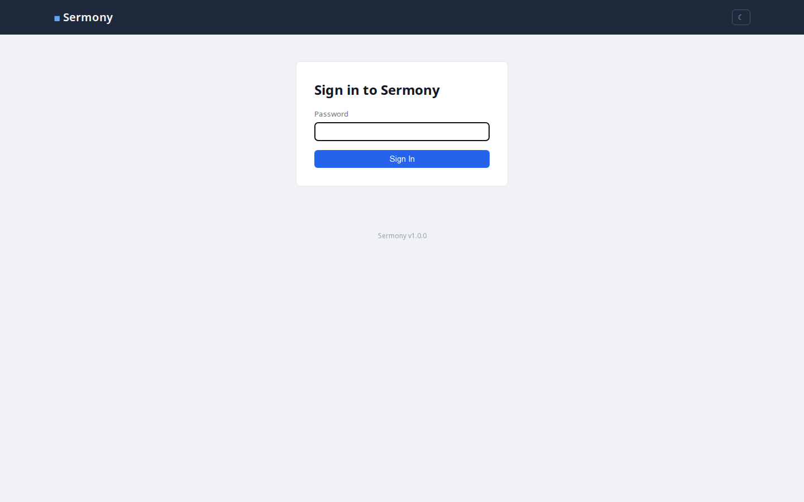
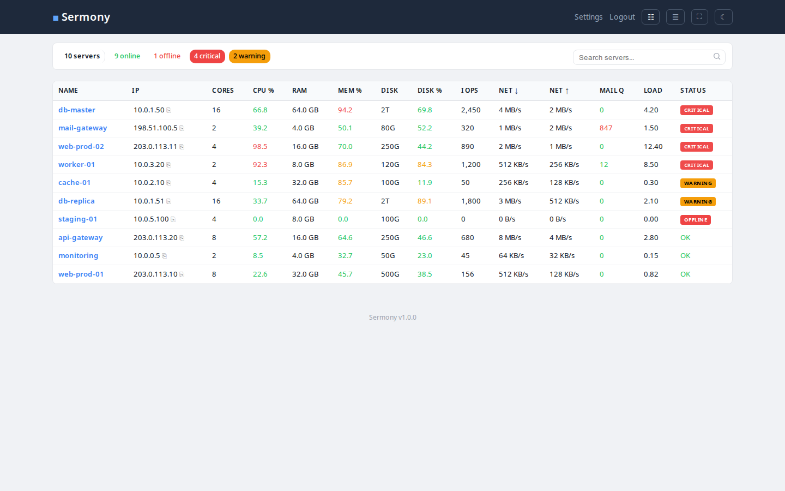

# Sermony

**Ser**ver **Mon**itoring Harmon**y** — simple, self-hosted server monitoring. One PHP file, one SQLite database, one Bash agent.

This is a **pet project** — built for personal use to monitor Ubuntu servers. It's intentionally minimal: no frameworks, no build steps, no dependencies beyond what's already on a standard LAMP stack. If you find it useful or want to improve it, contributions are welcome.

## Screenshots

### Login


### Dashboard (light)


### Dashboard (dark)


### Datagrid View (sortable by CPU, RAM, disk, cores, load)


### Server Detail (system info, NICs, Docker, services, sparklines)


### Settings


### Mobile
<p float="left">
  
  
</p>

## What it does

A central PHP web app receives metrics from remote Ubuntu/Linux servers via lightweight Bash agents. Each server gets its own card on a dashboard showing CPU, memory, disk, IOPS, network, mail queue, and load averages — with configurable warning/critical thresholds.

Servers are automatically sorted by severity — critical and warning servers float to the top. Servers that stop reporting are detected as **stale** (missed check-ins) and then **offline**, both with visual indicators.

## Requirements

**Server (dashboard):** PHP 8+, SQLite3, Apache/nginx/Caddy

**Monitored machines:** Ubuntu (tested), should work on most Debian-based distros. Requires Bash, curl, and cron.

## Quick Start

### 1. Deploy the server

Copy `index.php`, `install.sh`, and `sermony-agent.sh` to a PHP-enabled web directory:

```bash
cp index.php install.sh sermony-agent.sh /var/www/sermony/
```

Visit the URL — you'll be prompted to set an admin password. The database is created automatically.

### 2. Add servers to monitor

Go to **Settings** to find the install command, then run it on each machine:

```bash
curl -sSL 'https://your-server/?action=install-script' \
  | sudo bash -s -- \
  'https://your-server/' \
  'ENROLLMENT_KEY'
```

Optional third argument: interval in minutes (default: 15). Each server's interval can also be changed from the dashboard — the agent picks up the new interval automatically on its next run.

That's it. Servers appear on the dashboard automatically.

## Features

- Password-protected dashboard with session-based auth
- Three view modes: card grid, compact list, sortable datagrid
- Datagrid with sortable columns: name, CPU cores, CPU%, RAM, Mem%, disk total, Disk%, IOPS, load
- Fullscreen mode for wide monitors
- Search/filter servers by name, IP, FQDN, services, Docker images, PM2 processes, OS, CPU model
- Clickable status pills to filter by: online, offline, critical, warning, stale
- Dark/light theme (follows OS preference, manual toggle)
- Sparkline charts on server detail page (CPU/memory/disk trends)
- System info: CPU model/cores, RAM, disk, OS, kernel, uptime, network interfaces, DNS, Docker, services
- Per-interface details: name, state (UP/DOWN), IPv4, IPv6, MAC, link speed
- Docker container listing with image, status, and ports
- Active service detection (mysql, postgresql, nginx, postfix, redis, etc.)
- Auto-refresh dashboard without full page reload
- Browser notifications when servers go critical/offline/recover
- Drag-and-drop card reordering (persisted)
- Auto-sort by severity: critical > warning > stale > offline > healthy
- Stale detection — servers that miss expected check-ins get flagged
- Per-server configurable check intervals and alert thresholds (agents auto-update their cron)
- Email and webhook notifications with configurable cooldown
- Status badges: CRITICAL, WARNING, STALE, OFFLINE
- Custom display names and notes per server (notes shown as tooltip on hover)
- One-click IP copy with configurable SSH username (copies `user@ip`)
- Server timezone display on dashboard cards
- Export metrics as CSV
- Server detail page with metrics history (responsive on mobile)
- Enrollment key rotation with old key management
- Agent key rotation per server
- Secure enrollment flow (unique per-agent keys)
- Graceful degradation when agent tools are missing
- Plugin system for custom extensions
- Automatic metric retention cleanup

## Files

| File | Purpose |
|------|---------|
| `index.php` | Entire server app — routing, API, dashboard, settings, CSS, JS |
| `sermony-agent.sh` | Client agent — collects metrics, sends JSON via curl |
| `install.sh` | Client installer — enrolls, downloads agent, sets up cron |
| `fake-agents.sh` | Test script — creates 10 fake servers with various health states |
| `plugins/` | Plugin directory — drop-in PHP plugins for custom extensions |

## Plugins

Sermony supports a simple plugin system. Each plugin is a folder inside `plugins/` containing a `plugin.php` file that returns an array of hooks.

### Available Hooks

| Hook | Location | Receives |
|------|----------|----------|
| `dashboard_top` | Above server grid | — |
| `dashboard_card` | Inside each card, after metrics | `$server` |
| `dashboard_bottom` | Below server grid | — |
| `datagrid_columns` | Extra datagrid column headers | — |
| `datagrid_row` | Extra datagrid cells per row | `$server` |
| `server_detail` | Server detail, after system info | `$server` |
| `server_detail_bottom` | After metrics table | `$server`, `$metrics` |
| `after_ingest` | After metrics are saved | `$serverId`, `$metrics`, `$server` |
| `settings_panel` | Settings page, before Security | — |
| `header_links` | Header navigation area | — |
| `custom_action` | Handle custom URL actions | `$action` |
| `search_data` | Add terms to search index (filter) | `$parts`, `$server` |

### Included Plugins

| Plugin | Description |
|--------|-------------|
| [Credential Vault](plugins/vault/) | Encrypted server credential storage (AES-256-GCM, client-side crypto) |
| [API Key Manager](plugins/api-keys/) | Track API keys across servers — where used, spending, expiry |
| [PM2 Monitor](plugins/pm2/) | Monitor PM2 processes across servers with own agent script |
| [Example](plugins/example/) | Reference template with all hooks documented |

### Creating a Plugin

```bash
mkdir plugins/my-plugin
```

```php
<?php
// plugins/my-plugin/plugin.php
return [
    'name'    => 'My Plugin',
    'version' => '1.0',
    'author'  => 'Your Name',
    'hooks'   => [
        'dashboard_card' => function (array $server) {
            $info = json_decode($server['system_info'] ?? '{}', true);
            $uptime = $info['uptime'] ?? '';
            if ($uptime) {
                echo '<div class="m"><span class="ml">Uptime</span>';
                echo '<span class="mv">' . htmlspecialchars($uptime) . '</span></div>';
            }
        },
    ],
];
```

See `plugins/example/plugin.php` for a complete reference with all hooks documented.

## Security

- Password-protected dashboard (bcrypt, session-based)
- CSRF protection on all POST forms and JSON endpoints
- Login rate limiting (5 attempts, 15-minute lockout)
- Secure session cookies (SameSite=Strict, HttpOnly, Secure over HTTPS)
- 8-hour session timeout
- Content-Security-Policy header
- Prepared statements for all SQL
- `hash_equals()` for enrollment key and CSRF comparison
- Unique 64-char hex agent key per server (rotatable)
- Enrollment key rotation — old keys stay active until explicitly invalidated
- Login audit log (IP, timestamp, success/fail)
- Optional API IP allowlist for enroll/ingest endpoints
- Auto-generated `.htaccess` to block direct database file access
- Agent config stored chmod 600

## Uninstall agent

```bash
sudo crontab -l | grep -v sermony | sudo crontab -
sudo rm -rf /opt/sermony
```

## Contributing

This is a pet project, but changes are welcome. If you have a fix, improvement, or idea — open an issue or submit a pull request.
