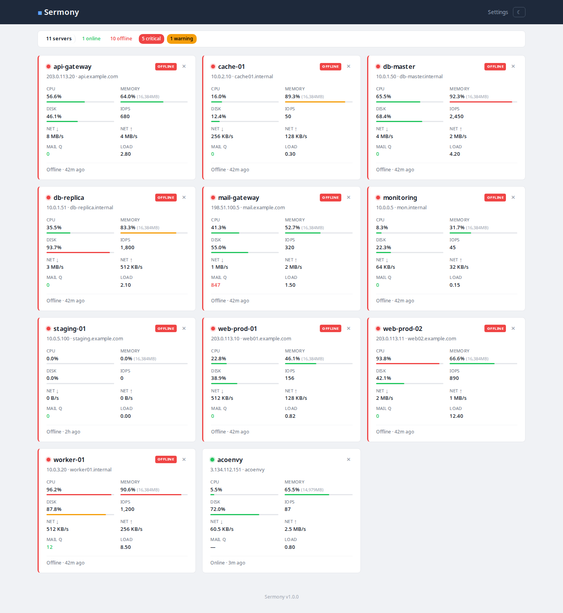
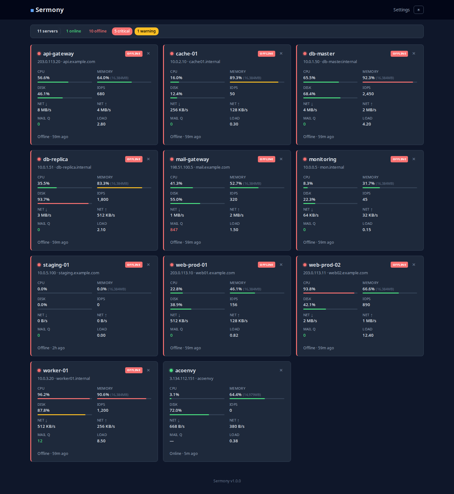
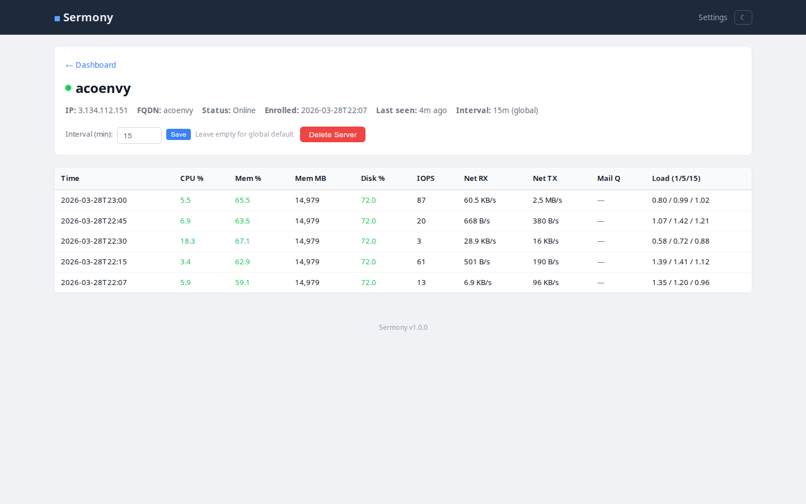
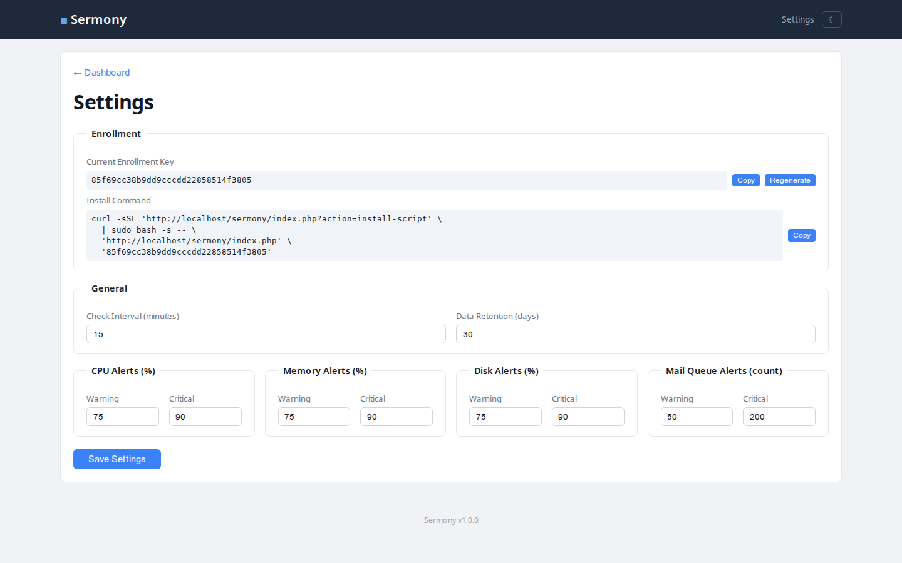
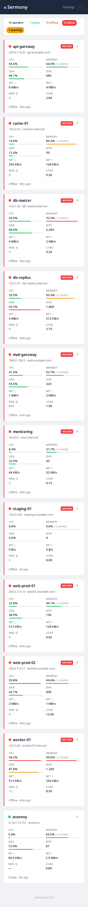
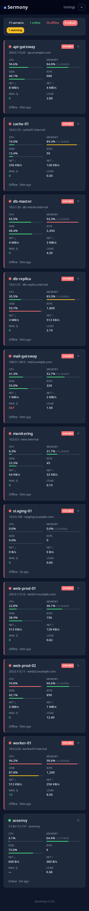

# Sermony

Simple, self-hosted server monitoring. One PHP file, one SQLite database, one Bash agent.

This is a **pet project** — built for personal use to monitor Ubuntu servers. It's intentionally minimal: no frameworks, no build steps, no dependencies beyond what's already on a standard LAMP stack. If you find it useful or want to improve it, contributions are welcome.

## Screenshots

### Dashboard (light)


### Dashboard (dark)


### Server Detail


### Settings


### Mobile
<p float="left">
  
  
</p>

## What it does

A central PHP web app receives metrics from remote Ubuntu/Linux servers via lightweight Bash agents. Each server gets its own card on a dashboard showing CPU, memory, disk, IOPS, network, mail queue, and load averages — with configurable warning/critical thresholds.

## Requirements

**Server (dashboard):** PHP 8+, SQLite3, Apache/nginx/Caddy

**Monitored machines:** Ubuntu (tested), should work on most Debian-based distros. Requires Bash, curl, and cron.

## Quick Start

### 1. Deploy the server

Copy `index.php`, `install.sh`, and `sermony-agent.sh` to a PHP-enabled web directory:

```bash
cp index.php install.sh sermony-agent.sh /var/www/sermony/
```

Visit the URL in your browser. The database is created automatically.

### 2. Add servers to monitor

Go to **Settings** to find the install command, then run it on each machine:

```bash
curl -sSL 'https://your-server/?action=install-script' \
  | sudo bash -s -- \
  'https://your-server/' \
  'ENROLLMENT_KEY'
```

Optional third argument: interval in minutes (default: 15). Each server's interval can also be configured individually from the server detail page.

That's it. Servers appear on the dashboard automatically.

## Features

- Dark/light theme (follows OS preference, manual toggle available)
- Drag-and-drop card reordering (persisted)
- Servers with issues automatically float to the top
- Per-server configurable check intervals
- Configurable alert thresholds (CPU, memory, disk, mail queue)
- Status badges: CRITICAL, WARNING, OFFLINE
- Server detail page with metrics history
- Settings page for enrollment, intervals, retention, and alert thresholds
- Enrollment key rotation with old key management
- Secure enrollment flow (unique per-agent keys)
- Graceful degradation when agent tools are missing
- Automatic metric retention cleanup

## Files

| File | Purpose |
|------|---------|
| `index.php` | Entire server app — routing, API, dashboard, settings, CSS, JS |
| `sermony-agent.sh` | Client agent — collects metrics, sends JSON via curl |
| `install.sh` | Client installer — enrolls, downloads agent, sets up cron |
| `fake-agents.sh` | Test script — creates 10 fake servers with various health states |

## Security

- Prepared statements for all SQL
- `hash_equals()` for enrollment key comparison
- Unique 64-char hex agent key per server
- Enrollment key rotation — old keys stay active until explicitly invalidated
- Agent config stored chmod 600
- No built-in dashboard auth — secure at web server level (`.htaccess`, `auth_basic`, Cloudflare Access, etc.)

## Uninstall agent

```bash
sudo crontab -l | grep -v sermony | sudo crontab -
sudo rm -rf /opt/sermony
```

## Contributing

This is a pet project, but changes are welcome. If you have a fix, improvement, or idea — open an issue or submit a pull request.
